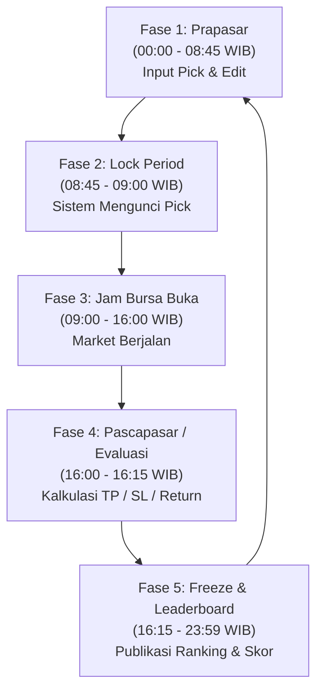

# BRIEFING & ARSITEKTUR SISTEM TRADEARENA

Dokumen ini menyajikan ringkasan menyeluruh mengenai cara kerja TradeArena, status kesiapan teknis saat ini, batasan, kebutuhan akun/resource eksternal, hingga estimasi dan rekomendasi hosting deployment.

---

## 1. Bagaimana Sistem TradeArena Bekerja?

TradeArena adalah platform kompetisi simulasi trading saham harian (Indonesian Stock Exchange / IDX) dengan mekanisme **1 Hari = 1 Saham Pilihan (Daily Pick)**.

### A. Siklus Operasional Harian (5 Fase)

1. **Fase 1: Prapasar (00:00 – 08:45 WIB)**
   - Peserta / Admin memilih 1 emiten saham beserta strategi:
     - TP (Take Profit %): misal +5%
     - SL (Stop Loss %): misal -3%
     - Trailing Stop: opsional (aktif setelah profit melewati threshold)
   - Pick dapat diubah bebas sebelum jam 08:45 WIB.
2. **Fase 2: Lock Period (08:45 – 09:00 WIB)**
   - Sistem secara otomatis mengunci seluruh pick.
   - Tidak ada penambahan atau pengubahan pick yang diizinkan (`403 Forbidden: Pick is locked`).
3. **Fase 3: Jam Bursa Buka (09:00 – 16:00 WIB)**
   - Bursa Efek Indonesia beroperasi. Harga saham berfluktuasi.
4. **Fase 4: Evaluasi Pascapasar (16:00 – 16:15 WIB)**
   - Mesin evaluator mengambil data candle 1-menitan (intraday) dari emiten yang dipilih.
   - **Simulasi Kronologis Menit per Menit**:
     - Cek apakah candle menit ke-X menyentuh level **SL** lebih dulu? Jika ya, exit di harga SL.
     - Cek apakah menyentuh level **TP** lebih dulu? Jika ya, exit di harga TP.
     - Cek apakah **Trailing Stop** aktif dan tersenggol?
     - Jika hingga menit 15:59 tidak menyentuh TP/SL, exit dilakukan pada **Close Price (EOD)**.
   - Sistem mencatat Return Net, Waktu Exit, dan Status Outcome (`TP_HIT`, `SL_HIT`, `TRAILING_STOP_HIT`, `EOD_CLOSE`).
5. **Fase 5: Freeze & Publikasi Leaderboard (16:15 – 23:59 WIB)**
   - Skor harian dihitung berdasarkan bobot turnamen:
     - Skor Return (misal: 60%)
     - Skor Win Rate (misal: 25%)
     - Skor RRR / Risk-Reward Ratio (misal: 15%)
   - Papan peringkat harian (*Daily*) dan kumulatif (*Aggregate*) diperbarui dan terkunci hingga esok hari.

---

## 2. Fitur yang SUDAH BISA vs BELUM BISA

| Area | Sudah Bisa Dilakukan (Production Ready) | Belum Bisa Dilakukan (Perlu Pengembangan) |
|---|---|---|
| **Turnamen** | Buat turnamen, atur tanggal mulai-selesai, atur bobot skor (Return/Win Rate/RRR), kunci & arsipkan turnamen. | Sistem pendaftaran turnamen berbayar / integrasi payment gateway. |
| **Peserta (Participants)** | Tambah peserta, daftarkan peserta ke turnamen, diskualifikasi (dengan catatan alasan), pulihkan peserta, hapus kepesertaan (unenroll + cascading pick cleanup). | Verifikasi KYC / Upload KTP (hanya verifikasi email & status approval). |
| **Picks (Pilihan Saham)** | Admin menginput pick atas nama peserta, validasi 1 pick/hari/turnamen, penguncian jam 08:45, audit log tiap perubahan pick. | **Peserta Login & Mandiri Input Pick**: Belum ada halaman portal khusus peserta untuk submit pick sendiri dari akun `USER`. |
| **Evaluasi & Scoring** | Engine evaluasi berbasis data candle 1m, trailing stop, TP/SL, pembobotan skor kustom per turnamen, 140/140 unit & e2e test lolos. | Evaluasi streaming real-time per detik via WebSocket saat market sedang jalan (saat ini sistem dirancang batch pascapasar). |
| **Leaderboard** | Leaderboard Harian, Leaderboard Kumulatif, filter tanggal, perankingan otomatis, export data ke CSV dan PDF. | Share badge/grafik ke media sosial secara instan (gambar generator). |
| **User & Keamanan** | Role `ADMIN` & `USER`, status akun (`PENDING`, `APPROVED`, `REJECTED`, `DISQUALIFIED`), approval workflow di `/users`, JWT Bearer Auth. | Reset password via email SMTP (saat ini via database/admin). |
| **Tampilan / UI** | Modern glassmorphism dark mode, responsif, custom confirmation modal interaktif (tanpa popup browser kaku). | Mode tampilan Light Mode (saat ini murni Dark Aesthetic). |

---

## 3. Batasan Sistem Saat Ini (Current Limitations)

1. **Mekanisme Evaluasi adalah Batch Post-Market (16:00 WIB)**
   - Sistem **bukan** trading terminal real-time seperti TradingView / RTI yang menampilkan chart tick-by-tick per detik.
   - Evaluasi dijalankan sekali di akhir hari pasar menggunakan rekaman candle 1 menit untuk merekonstruksi hasil trading peserta.
2. **Kapasitas 1 Saham per Peserta per Hari**
   - Aturan baku platform: Peserta hanya bertanding dengan 1 saham pilihan terbaik mereka setiap hari bursa.
3. **Admin-Centric Operations**
   - Saat ini, alur paling matang adalah **Admin-Managed Tournament**: Panitia mengumpulkan pick peserta (via formulir atau komunitas) lalu Admin mengelola & menginput di dashboard.

---

## 4. Kebutuhan Akun / Resource Eksternal (Data Feed & Layanan Luar)

Arsitektur TradeArena sudah dibuat modular. Di bawah ini adalah resource yang **sudah difasilitasi kodenya**, namun membutuhkan registrasi akun pihak ketiga saat ingin live market:

### A. Data Feed Saham IDX (Penyedia Data Bursa)
- **Status Kode Saat Ini**: Backend sudah memiliki adapter `HttpMarketDataProvider` dan `MockMarketDataProvider` yang di-switch via file `.env` (`MARKET_DATA_PROVIDER=mock|http`).
- **Kondisi Testing**: Menggunakan data mock realistis berdasar algoritma pergerakan harga IDX (bebas biaya, tanpa akun).
- **Jika Ingin Data Real IDX**:
  - Butuh akun penyedia API data saham Indonesia, contoh:
    1. **GoAPI.id**: Menyediakan endpoint data saham IDX (harga EOD dan intraday). Biaya mulai dari free-tier hingga berbayar (~Rp 100k - 300k/bln).
    2. **FMP / Polygon / AlphaVantage**: Umumnya hanya saham US, kurang optimal untuk IHSG.
    3. **Custom Scraper / Feed Internal**: Jika memiliki sumber data sendiri, tinggal mengarahkan `MARKET_DATA_BASE_URL` dan `MARKET_DATA_API_KEY`.

### B. Google Single Sign-On (Google OAuth)
- **Status Kode Saat Ini**: Backend API `POST /api/v1/auth/google` sudah siap memvalidasi Google ID Token. Frontend memiliki mock-modal untuk pengujian lokal.
- **Kebutuhan Live**:
  - Akun **Google Cloud Console** (Gratis).
  - Buat project baru -> *APIs & Services* -> *OAuth Consent Screen* -> Buat *OAuth Client ID (Web Application)*.
  - Masukkan domain live Anda ke *Authorized Javascript Origins*.
  - Salin Client ID ke file `.env` frontend.

### C. Domain & SSL (HTTPS)
- Domain: Bisa menggunakan domain murah (misal `.my.id` seharga ~Rp 12.000 / tahun, atau `.com` ~Rp 140.000 / tahun).
- SSL: Gratis menggunakan **Let's Encrypt** (Certbot) via Nginx Reverse Proxy.

---

## 5. Kesimpulan Kesiapan: Deploy Langsung Pakai atau Butuh Penyesuaian?

> **Jawaban Tegas:** Tergantung Skema Kompetisi yang Ingin Dijalankan.

### Skenario 1: Kompetisi Model Admin / Panitia (SIAP PAKAI SEKARANG)
- **Alur**: Peserta mendaftar, mengumpulkan pick saham harian ke panitia (via WhatsApp Group / Google Forms / Discord). Admin memasukkan pick peserta di dashboard TradeArena. Pada jam 16:00, sistem menghitung hasil secara otomatis dan peserta bisa melihat Leaderboard publik di website.
- **Status**: **100% SIAP DEPLOY & PAKAI TANPA PENYESUAIAN KODE LAGI.**

### Skenario 2: Kompetisi Full Self-Service (BUTUH 1 PENYESUAIAN FITUR)
- **Alur**: Peserta membuat akun sendiri, login ke portal peserta, lalu memilih saham mereka sendiri setiap pagi sebelum 08:45 WIB.
- **Status**: **Butuh Milestone Tambahan: "Portal Input Pick Mandiri untuk Peserta"**.
  - Saat ini formulir input pick berada di dalam dashboard turnamen yang diakses oleh `ADMIN`.
  - Kita perlu menambahkan 1 halaman `/my-picks` atau modal khusus agar user biasa dengan role `USER` dapat langsung menginput pick miliknya sendiri.

---

## 6. Rekomendasi Deployment Termurah (Maksimal Rp 100.000 / Bulan)

### A. Analisis Kebutuhan Resource (RAM & CPU)
Aplikasi TradeArena dijalankan via Docker Compose (`docker-compose.prod.yml`):
- Backend (NestJS + Node.js): ~180 MB – 250 MB RAM
- Frontend (Next.js Standalone): ~200 MB – 300 MB RAM
- Database (PostgreSQL 16 Alpine): ~100 MB – 150 MB RAM
- Cache / Lock (Redis 7 Alpine): ~30 MB – 50 MB RAM
- Nginx Reverse Proxy: ~20 MB RAM
- **Total Kebutuhan Bersih**: **~600 MB – 800 MB RAM**.

> **Tips Wajib**: Di Linux VPS, kita wajib membuat **Swap Memory 2 GB** (virtual memory di SSD). Dengan trik ini, VPS dengan RAM 1 GB mampu berjalan sangat stabil tanpa risiko crash / *Out Of Memory (OOM)*.

---

### B. Pilihan Provider VPS Rekomendasi (≤ Rp 100.000/bln)

| Provider | Paket & Spesifikasi | Harga / Bulan | Lokasi Server | Kelebihan & Catatan |
|---|---|---|---|---|
| **1. IDCloudHost (Sangat Direkomendasikan)** | **Cloud VPS 1 GB** 1 vCPU, 1 GB RAM, 20 GB SSD Storage | **± Rp 50.000 – Rp 60.000** (Sistem billing per jam / hourly) | Jakarta / Cyber Data Center | Latensi super cepat ke pasar saham Indonesia (IDX), pembayaran mudah (QRIS, GoPay, Transfer Bank lokal). |
| **2. IDCloudHost (Alternatif Nyaman)** | **Cloud VPS 2 GB** 1 vCPU, 2 GB RAM, 20 GB SSD Storage | **± Rp 100.000** | Jakarta | Pas dengan budget maksimal Rp 100k, RAM 2 GB sangat longgar untuk test turnamen skala sedang. |
| **3. Biznet GIO** | **NEO Lite XS 1.1** 1 vCPU, 1 GB RAM, 20 GB Storage | **± Rp 55.000** | Jakarta | Jaringan Biznet stabil, harga murah meriah, lokal Indonesia. |
| **4. DomaiNesia** | **Cloud VPS Micro** 1 vCPU, 1 GB RAM, 20 GB SSD | **± Rp 80.000 – Rp 90.000** | Jakarta / Singapore | Support tiket bahasa Indonesia ramah, setup cepat. |

---

## 7. Status Eksekusi Terkini & Langkah Menuju Deploy

✅ **Jalur B Telah Selesai Dibangun (Milestone M11: Portal Input Mandiri Peserta & Lock 08:45 WIB)**:
- Halaman Portal Peserta Mandiri di `/my-picks` sudah aktif dengan jam pasar WIB digital real-time.
- Pemilihan emiten saham IDX mandiri, estimasi entry price, dan kalkulasi level Stop Loss otomatis (-3%).
- Penegakan kunci pick otomatis pada pukul 08:45 WIB (`403 Forbidden` jika lewat batas waktu).
- Tabel riwayat pick dan trade peserta beserta inspeksi bukti (*Evidence*).
- Seluruh 16 suite test unit & integrasi backend lolos 100%.

🚀 **Langkah Selanjutnya: Milestone M12 — Deployment Production**:
- Siapkan VPS murah (rekomendasi IDCloudHost 1 GB / 2 GB Jakarta, budget Rp 50.000 – Rp 100.000 / bulan).
- Konfigurasi Docker Compose (`docker-compose.prod.yml`), Nginx reverse proxy, dan Let's Encrypt SSL.
- Sistem kini 100% siap digunakan baik untuk skema Panitia/Admin maupun skema Peserta Mandiri!
